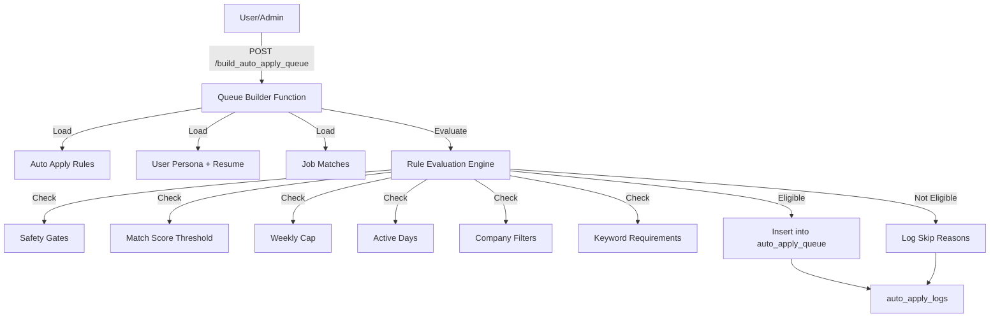

# Auto-Apply Queue System

This document describes the Auto-Apply queue builder system - the deterministic engine that evaluates job matches against rules and queues eligible jobs for processing. **This system does NOT submit applications**, it only decides what WOULD be applied to and queues items safely.

## System Architecture



### Components

1. **Rule Evaluation Engine** (`rules.ts`)
   - Pure deterministic logic (NO AI)
   - Applies all rule checks in sequence
   - Returns eligible/not eligible with detailed reasons
   - Severity levels: `info`, `warn`, `block`

2. **Queue Builder Function** (`build_queue.ts`)
   - Netlify Function endpoint
   - Authenticates user via JWT or admin secret
   - Loads rules and evaluates job candidates
   - Inserts eligible jobs into queue
   - Logs all decisions for transparency

3. **Database Tables**
   - `auto_apply_rules` - User-defined rules
   - `auto_apply_queue` - Jobs queued for processing
   - `auto_apply_logs` - Audit trail of all decisions
   - `user_personas` - Persona configurations
   - `job_matches` - Scored job matches

## Rule Configuration

Auto-apply rules support the following criteria:

### Match Score Threshold

```typescript
{
  match_score_threshold: 70 // Only queue jobs with match score >= 70
}
```

- If not set, all scores accepted
- **BLOCKS** if job score is below threshold

### Weekly Application Cap

```typescript
{
  max_applications_per_week: 10 // Maximum 10 applications per week
}
```

- Counts applications from start of week (Monday 00:00)
- **BLOCKS** if cap already reached
- If not set, no limit enforced

### Active Days

```typescript
{
  active_days: ['mon', 'tue', 'wed', 'thu', 'fri'] // Weekdays only
}
```

- Valid values: `['sun', 'mon', 'tue', 'wed', 'thu', 'fri', 'sat']`
- **WARNS** if current day not in list
- If not set, all days are active

### Company Filters

```typescript
{
  exclude_companies: ['CompanyA', 'CompanyB'], // Never apply to these
  include_only_companies: ['CompanyC', 'CompanyD'] // Only these companies
}
```

- `exclude_companies` takes precedence over `include_only_companies`
- Case-insensitive partial matching
- **WARNS** if excluded or not included
- If both null, no filtering applied

### Keyword Requirements

```typescript
{
  require_all_keywords: ['React', 'TypeScript', 'Remote']
}
```

- ALL keywords must appear in job title OR description
- Case-insensitive matching
- **WARNS** if any keyword missing
- If not set, no keyword requirements

### Safety Gates

Automatically enforced:

1. **Resume Required**
   - Persona must have `resume_id` set
   - **BLOCKS** if missing

2. **Job URL Required**
   - Job must have valid `external_url`
   - **BLOCKS** if missing

## Local Development

### Prerequisites

1. **Supabase Local Development**
   ```bash
   supabase start
   ```

2. **Environment Variables**
   ```bash
   # .env
   SUPABASE_URL=https://your-project.supabase.co
   SUPABASE_SERVICE_ROLE_KEY=your_actual_service_role_key
   ADMIN_SECRET=your_actual_admin_secret
   ```

3. **Install Dependencies**
   ```bash
   npm install
   ```

### Run Queue Builder Manually

#### As Authenticated User

```bash
curl -X POST http://localhost:8888/.netlify/functions/build_auto_apply_queue \
  -H "Authorization: Bearer <your_jwt_token>" \
  -H "Content-Type: application/json"
```

#### As Admin (Debug Mode)

```bash
curl -X POST http://localhost:8888/.netlify/functions/build_auto_apply_queue \
  -H "X-Admin-Secret: <your_admin_secret>" \
  -H "Content-Type: application/json" \
  -d '{"user_id": "<user_uuid>"}'
```

### Inspect Queue Entries

```sql
-- View queued jobs
SELECT 
  q.*,
  j.title,
  j.company,
  r.name as rule_name
FROM auto_apply_queue q
JOIN jobs j ON q.job_id = j.id
JOIN auto_apply_rules r ON q.rule_id = r.id
WHERE q.user_id = '<user_uuid>'
  AND q.status = 'pending'
ORDER BY q.created_at DESC;
```

### View Logs

```sql
-- View all logs with reasons
SELECT 
  l.*,
  j.title,
  r.name as rule_name
FROM auto_apply_logs l
LEFT JOIN jobs j ON l.job_id = j.id
LEFT JOIN auto_apply_rules r ON l.rule_id = r.id
WHERE l.user_id = '<user_uuid>'
ORDER BY l.created_at DESC
LIMIT 50;
```

## API Examples

### Success Response

```json
{
  "message": "Queue building complete",
  "queued": 5,
  "skipped": 12,
  "rules_processed": 2,
  "logs": [
    {
      "job_id": "job-123",
      "rule_id": "rule-456",
      "status": "queued",
      "reasons": null
    },
    {
      "job_id": "job-789",
      "rule_id": "rule-456",
      "status": "skipped",
      "reasons": "BLOCK: Match score 65 below threshold 70"
    }
  ]
}
```

### Error Response - No Resume

```json
{
  "message": "Queue building complete",
  "queued": 0,
  "skipped": 10,
  "rules_processed": 1,
  "logs": [
    {
      "job_id": "job-123",
      "rule_id": "rule-456",
      "status": "skipped",
      "reasons": "BLOCK: Persona does not have a resume attached (resume_id is null)"
    }
  ]
}
```

### Error Response - Cap Exceeded

```json
{
  "logs": [
    {
      "job_id": "job-123",
      "rule_id": "rule-456",
      "status": "skipped",
      "reasons": "BLOCK: Weekly cap reached (10/10)"
    }
  ]
}
```

## Troubleshooting

### No Jobs Queued

**Symptom**: `queued: 0` in response

**Possible Causes**:

1. **No enabled rules**
   ```sql
   SELECT * FROM auto_apply_rules 
   WHERE user_id = '<user_uuid>' 
     AND enabled = true;
   ```

2. **No job matches**
   ```sql
   SELECT COUNT(*) FROM job_matches 
   WHERE user_id = '<user_uuid>' 
     AND is_dismissed = false;
   ```

3. **All jobs already queued/applied**
   - Check `auto_apply_queue` and `applications` tables for existing entries

4. **Safety gates blocking**
   - Check logs for "BLOCK: Persona does not have a resume"
   - Check logs for "BLOCK: Job does not have a valid application URL"

5. **Match score too low**
   - Check rule's `match_score_threshold`
   - Check job_matches scores: `SELECT match_score FROM job_matches WHERE ...`

### Weekly Cap Exceeded

**Symptom**: Logs show "Weekly cap reached"

**Solution**:
- Wait until next week (Monday 00:00)
- OR increase `max_applications_per_week` in rule
- OR disable/adjust the rule

### Company Filter Blocking

**Symptom**: Logs show "Company in exclude list" or "not in include_only list"

**Solution**:
- Review rule's `exclude_companies` and `include_only_companies`
- Update filters if needed
- Note: These are WARNINGS, not blocks (job still eligible but logged)

### Debugging Rule Evaluation

Enable detailed logging:

```typescript
// In rules.ts, add console.log statements
console.log('Evaluating job:', job.id, job.title)
console.log('Rule:', rule.name)
console.log('Match score:', match.match_score)
console.log('Result:', result)
```

Run queue builder and check Netlify Function logs:

```bash
netlify dev
# Watch terminal output
```

## Weekly Cap Calculation

The weekly cap is calculated from **Monday 00:00:00** (start of week) to **Sunday 23:59:59**.

```typescript
function getStartOfWeek(): Date {
  const now = new Date()
  const dayOfWeek = now.getDay()
  const diff = dayOfWeek === 0 ? -6 : 1 - dayOfWeek // Monday is 1
  const monday = new Date(now)
  monday.setDate(now.getDate() + diff)
  monday.setHours(0, 0, 0, 0)
  return monday
}
```

Count query:

```sql
SELECT COUNT(*) FROM auto_apply_logs
WHERE user_id = '<user_uuid>'
  AND status = 'queued'
  AND created_at >= '<start_of_week_iso>';
```

## Security Considerations

### Admin Secret

- Set `ADMIN_SECRET` environment variable securely
- Never commit to version control
- Use for debugging/testing only
- Rotate periodically

### JWT Authentication

- User tokens expire (default: 1 hour)
- Refresh tokens as needed
- Tokens are verified server-side via Supabase

### Row Level Security (RLS)

All database operations respect RLS policies:
- Users can only queue jobs for themselves
- Coaches can view client queues (if coach relationship exists)
- Admin client bypasses RLS (use with caution)

## Next Steps

This queue builder is **Phase 1** of the Auto-Apply system. After queueing, future phases will:

1. **Process Queue** - Pick up queued jobs and generate tailored artifacts (resume, cover letter)
2. **Submit Applications** - Actually submit to external URLs (with user approval if required)
3. **Track Status** - Monitor application status and update users

See [AUTO_APPLY_STATE_MACHINE.md](./AUTO_APPLY_STATE_MACHINE.md) for the complete workflow.

## Related Documentation

- [AUTO_APPLY_STATE_MACHINE.md](./AUTO_APPLY_STATE_MACHINE.md) - Application lifecycle
- [AUTO_APPLY_QUICK_REF.md](./AUTO_APPLY_QUICK_REF.md) - Quick reference
- [SCHEMA_V2.md](./SCHEMA_V2.md) - Database schema

## Running Tests

```bash
# Run all auto-apply tests
npm test -- auto_apply

# Run specific test file
npm test -- rules.test.ts
npm test -- build_queue.test.ts

# Watch mode
npm test -- --watch auto_apply
```
