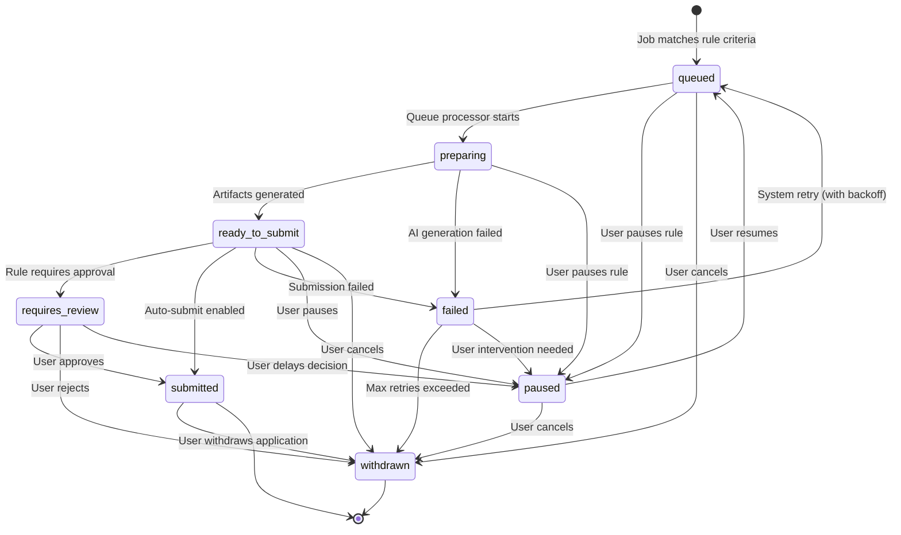

# Auto-Apply State Machine

This document defines the application state machine for Relevnt's Auto-Apply system. The state machine ensures deterministic, auditable transitions through the application workflow.

## Application States

### State Definitions

| State | Description | User Visible? | Action Required |
|-------|-------------|---------------|-----------------|
| **queued** | Job identified and added to processing queue | Yes | None (system will process) |
| **preparing** | AI is generating tailored resume/cover letter | Yes | None (processing) |
| **ready_to_submit** | Artifacts ready, awaiting submission | Yes | Depends on rule settings |
| **submitted** | Successfully submitted to external application site | Yes | Track application progress |
| **failed** | Submission attempt failed | Yes | Review error, retry manually |
| **paused** | User or system paused processing | Yes | User must resume or cancel |
| **requires_review** | User review required before submission | Yes | **User must approve or reject** |
| **withdrawn** | Application withdrawn by user | Yes | None (terminal state) |

### State Categories

- **In Progress**: `queued`, `preparing`, `ready_to_submit`
- **Requires Action**: `requires_review`, `paused`, `failed`
- **Terminal**: `submitted`, `withdrawn`

---

## State Transitions

### Allowed Transitions



### Transition Rules

#### From `queued`

- ✅ → `preparing`: Queue processor picks up job
- ✅ → `paused`: User pauses auto-apply rule
- ✅ → `withdrawn`: User explicitly cancels this application
- ❌ Cannot skip directly to `submitted`

#### From `preparing`

- ✅ → `ready_to_submit`: All artifacts successfully generated
- ✅ → `failed`: AI generation error (will retry based on error type)
- ✅ → `paused`: User pauses rule during preparation
- ❌ Cannot transition to `submitted` without going through `ready_to_submit`

#### From `ready_to_submit`

- ✅ → `requires_review`: Rule configured with `require_user_approval: true`
- ✅ → `submitted`: Auto-submit enabled and submission succeeds
- ✅ → `failed`: Submission attempt fails
- ✅ → `paused`: User pauses before submission
- ✅ → `withdrawn`: User cancels after review

#### From `requires_review`

- ✅ → `submitted`: User clicks "Approve & Submit"
- ✅ → `withdrawn`: User clicks "Reject"
- ✅ → `paused`: User clicks "Decide Later"

#### From `failed`

- ✅ → `queued`: Retry if `attempt_count < max_retries` (default 3)
- ✅ → `withdrawn`: Max retries exceeded OR user gives up
- ✅ → `paused`: User wants to investigate manually

#### From `paused`

- ✅ → `queued`: User resumes rule (re-enters queue)
- ✅ → `withdrawn`: User cancels application

#### From `submitted` / `withdrawn`

- Terminal states (no automatic transitions)
- `submitted` → `withdrawn`: Only user action (manual withdrawal)

---

## Netlify Function Mapping

| State Transition | Netlify Function | Trigger |
|------------------|------------------|---------|
| Job → `queued` | `auto-apply/enqueue.ts` | Scheduled job matcher |
| `queued` → `preparing` | `auto-apply/process-queue.ts` | Queue processor (cron) |
| `preparing` → `ready_to_submit` | `auto-apply/prepare-application.ts` | Called by queue processor |
| `ready_to_submit` → `submitted` | `auto-apply/submit.ts` | Auto-submit if enabled |
| `requires_review` → `submitted` | `auto-apply/submit.ts` | User approval endpoint |
| `failed` → `queued` | `auto-apply/retry-handler.ts` | Retry scheduler (cron) |
| Any → `paused` | `auto-apply/pause.ts` | User action |
| Any → `withdrawn` | `auto-apply/withdraw.ts` | User action |

### Function Responsibilities

#### `auto-apply/enqueue.ts`
- Matches jobs against active auto-apply rules
- Creates queue entries with `status: 'queued'`
- Checks duplicate constraints before inserting
- Respects `max_applications_per_week` limits

#### `auto-apply/process-queue.ts` (Cron: every 5 minutes)
- Fetches `queued` entries with `scheduled_for <= now()`
- Transitions to `preparing`
- Calls AI system to generate artifacts
- Transitions to `ready_to_submit` on success or `failed` on error

#### `auto-apply/prepare-application.ts`
- Calls `runAI()` with task `'generate_tailored_resume'` and `'generate_cover_letter'`
- Stores artifacts in `job_application_artifacts` table
- Updates `applications` table with `trace_id` for auditability
- Returns artifact IDs

#### `auto-apply/submit.ts`
- For `ready_to_submit` → `submitted`: checks if auto-submit enabled
- For `requires_review` → `submitted`: requires user authentication + approval
- Opens external application URL (future: integration with ATS APIs)
- Records submission in `auto_apply_logs`
- Updates `applications.status` to `submitted`

#### `auto-apply/retry-handler.ts` (Cron: every 30 minutes)
- Finds `failed` applications with `attempt_count < max_retries`
- Applies exponential backoff: `scheduled_for = now() + (2^attempt_count * 15 minutes)`
- Transitions back to `queued` for retry
- Marks as `withdrawn` if max retries exceeded

#### `auto-apply/pause.ts`
- User endpoint to pause processing
- Transitions current application to `paused`
- Can also disable entire rule (affects all queued jobs)

#### `auto-apply/withdraw.ts`
- User endpoint to withdraw application
- Transitions to `withdrawn` (terminal)
- If application was `submitted`, records withdrawal in logs

---

## Error Handling & Recovery

### Retry Strategy

| Error Type | Action | Max Retries |
|------------|--------|-------------|
| AI generation timeout | Retry with backoff | 3 |
| AI quota exceeded | Pause for 1 hour, then retry | 5 |
| External site unreachable | Retry with backoff | 3 |
| Invalid job URL | Mark as `withdrawn` | 0 (no retry) |
| User quota exceeded | `paused` until quota resets | N/A |

### Backoff Formula

```
delay_minutes = 2^attempt_count * 15
```

- Attempt 1: 15 minutes
- Attempt 2: 30 minutes
- Attempt 3: 60 minutes

### Dead Letter Queue

Applications that fail after max retries are:
1. Marked as `withdrawn`
2. `last_error` field populated with detailed error
3. User notified via email/dashboard
4. Logged in `auto_apply_logs` with `status: 'failed'`

---

## Monitoring & Observability

### Key Metrics

| Metric | Description | Query |
|--------|-------------|-------|
| Queue lag | Time from `created_at` to `processed_at` for `queued` entries | `AVG(processed_at - created_at)` |
| Success rate | % of `submitted` vs `failed` + `withdrawn` | `COUNT(submitted) / COUNT(*)` |
| Retry rate | % of applications requiring retries | `COUNT(attempt_count > 1) / COUNT(*)` |
| Review backlog | Count of `requires_review` older than 24h | `COUNT(*)` WHERE `status = 'requires_review' AND created_at < now() - interval '24 hours'` |

### Alerts

- **High queue lag** (>30 minutes): Indicates processing bottleneck
- **High failure rate** (>20%): AI or submission infrastructure issues
- **Stale reviews** (>48 hours): User may need nudge to review applications

---

## Safety & Compliance

### Rate Limiting

- **Per-user daily limit**: 10 applications (configurable via `auto_apply_rules.max_applications_per_week / 7`)
- **Per-company cooldown**: 7 days between applications to same company
- **Global system limit**: 1000 applications/hour (circuit breaker)

### Audit Trail

Every state transition is logged with:
- `trace_id`: Links to AI invocation logs
- `user_id`: Who triggered (or system if automated)
- Timestamp of transition
- Previous state → New state
- Reason for transition

### User Controls

Users can:
- Pause any rule or individual application
- Withdraw any application (even after submission)
- Set `require_user_approval: true` to review before submission
- View all artifacts generated for transparency

---

## Future Enhancements

### Planned States

- **`validating`**: Pre-submission validation (check if job still open)
- **`scheduled`**: User chose specific submission time
- **`interview_requested`**: ATS integration detected interview request

### Planned Integrations

- **ATS APIs**: Direct submission to Greenhouse, Lever, Workday
- **Calendar integration**: Schedule follow-ups automatically
- **Email tracking**: Detect application status updates

---

## References

- Migration: [20241215_auto_apply_foundation.sql](file:///Users/sarahsahl/Desktop/relevnt-fresh/supabase/migrations/20241215_auto_apply_foundation.sql)
- AI Routing: [netlify/functions/ai/run.ts](file:///Users/sarahsahl/Desktop/relevnt-fresh/netlify/functions/ai/run.ts)
- Schema Docs: [SCHEMA_V2.md](file:///Users/sarahsahl/Desktop/relevnt-fresh/docs/SCHEMA_V2.md)
