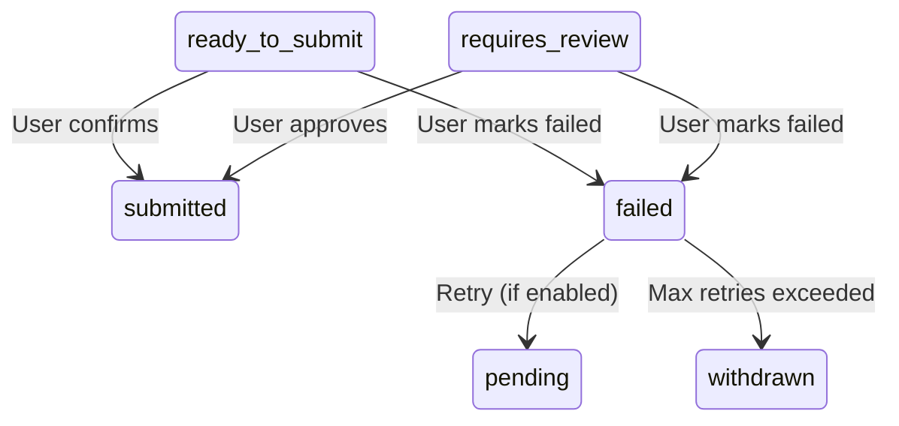

# Auto-Apply Submission MVP - User Documentation

## Overview

The Auto-Apply Submission MVP enables users to efficiently manage and submit job applications from their auto-apply queue. This system does **NOT** automate form filling on third-party sites. Instead, it provides a streamlined interface for:

- Viewing queued applications ready for submission
- Opening application URLs in new tabs
- Manually confirming submissions with proof tracking
- Reporting submission failures with retry options

---

## User Flow

### 1. View Your Queue

Navigate to the Auto-Apply Queue Panel to see all items that need your attention:

- **Ready to Submit** - Applications with generated materials ready to go
- **Requires Review** - Applications that need your approval before submission
- **Pending/Processing** - Applications being prepared by the system

### 2. Review Generated Materials

Click **"Preview Materials"** on any queue item to view:
- Tailored resume bullets
- Custom cover letter (if applicable)
- Match score and evaluation reasons

### 3. Open Application Link

When ready to apply:
1. Click **"Open Link"** to open the job posting in a new tab
2. Complete the application on the employer's site using the generated materials
3. Return to the Queue Panel when done

### 4. Confirm Submission

After successfully submitting:
1. Click **"Confirm Submitted"**
2. Optionally add:
   - **Proof notes** (e.g., "Submitted via LinkedIn, confirmation email received")
   - **Screenshot URL** (link to proof screenshot if you uploaded one)
3. Click **"Confirm Submitted"**

The application moves to your submitted applications list and is tracked for follow-up.

### 5. Mark as Failed (if needed)

If you encounter issues:
1. Click **"Mark Failed"**
2. Describe what went wrong (e.g., "Job posting expired", "Login required")
3. Choose whether to **"Retry automatically later"**
4. Click **"Mark Failed"**

The system logs the error and can retry up to 3 times with exponential backoff if requested.

---

## API Reference

### POST /.netlify/functions/auto_apply_mark_submitted

Mark a queue item as successfully submitted.

**Authentication**: Required (JWT Bearer token)

**Request Body**:
```json
{
  "queue_item_id": "uuid-of-queue-item",
  "notes": "Optional proof notes",
  "screenshot_url": "https://optional-screenshot-url.com"
}
```

**Response** (200 OK):
```json
{
  "success": true,
  "application_id": "uuid-of-created-application",
  "job_title": "Senior Software Engineer",
  "company": "TechCorp",
  "message": "Application marked as submitted successfully"
}
```

**Error Responses**:
- `400` - Invalid state transition (already submitted)
- `401` - Unauthorized (invalid/missing JWT)
- `403` - Forbidden (queue item belongs to another user)
- `404` - Queue item not found
- `500` - Server error

---

### POST /.netlify/functions/auto_apply_mark_failed

Mark a queue item as failed.

**Authentication**: Required (JWT Bearer token)

**Request Body**:
```json
{
  "queue_item_id": "uuid-of-queue-item",
  "error_message": "Job posting expired",
  "should_retry": false
}
```

**Response** (200 OK):
```json
{
  "success": true,
  "queue_item_id": "uuid",
  "status": "failed",
  "job_title": "Senior Software Engineer",
  "company": "TechCorp",
  "attempt_count": 1,
  "will_retry": false,
  "retry_at": null,
  "message": "Application marked as failed"
}
```

**Retry Logic**:
- If `should_retry: true` and `attempt_count < 3`, item is re-queued
- Retry delay: `2^attempt_count * 15 minutes`
  - Attempt 1: 15 min
  - Attempt 2: 30 min
  - Attempt 3: 60 min

---

## State Transitions

Valid state transitions during submission:



### State Definitions

| State | Description | User Action |
|-------|-------------|-------------|
| `ready_to_submit` | Materials ready, can be submitted | Open link → submit → confirm |
| `requires_review` | User must review before submission | Same as ready_to_submit |
| `submitted` | Successfully submitted | Track application progress |
| `failed` | Submission failed | Review error, retry manually |

---

## Audit & Compliance

### Double-Submission Prevention

The system prevents duplicate applications through:

1. **Database constraint**: Unique index on `(user_id, job_id)` in `applications` table
2. **Status check**: Endpoints reject requests if item not in `ready_to_submit` or `requires_review`
3. **Existing application check**: Queries for existing non-withdrawn applications before creating new ones

### Audit Logging

Every submission action is logged in three places:

1. **`applications` table** - Full application record with status and metadata
2. **`auto_apply_queue` table** - Queue item updated to `completed`
3. **`auto_apply_logs` table** - Event log with timestamp, status, and artifacts

All logs include:
- User ID
- Job ID
- Persona ID (if applicable)
- Rule ID
- Trace ID (links to AI generation)
- Attempt count
- Timestamps

### Analytics Events

Tracked events for product insights:

| Event | Properties | When Triggered |
|-------|-----------|----------------|
| `auto_apply_opened_link` | `queue_item_id`, `job_id` | User clicks "Open Link" |
| `auto_apply_marked_submitted` | `queue_item_id`, `has_proof`, `has_notes`, `has_screenshot` | User confirms submission |
| `auto_apply_marked_failed` | `queue_item_id`, `error_type`, `attempt_count`, `will_retry` | User reports failure |

---

## Error Handling

### Common Errors & Solutions

| Error Type | Cause | Solution |
|------------|-------|----------|
| Job posting closed | Employer filled position | Mark as failed, don't retry |
| Site unreachable | Temporary outage | Mark as failed, enable retry |
| Login required | Need employer account | Create account manually, then submit |
| Upload issues | File format/size | Adjust file and retry |

### Error Categorization

Failed submissions are automatically categorized:

- `job_closed` - Position no longer available
- `site_error` - Technical issue with employer site
- `auth_required` - Login/account needed
- `upload_issue` - Resume/document upload problem
- `other` - Uncategorized

This helps identify patterns and improve the system.

---

## Privacy & Security

### Data Storage

- **Proof notes**: Stored in `applications.metadata.proof_notes`
- **Screenshot URLs**: Stored in `applications.metadata.screenshot_url` (external links only)
- **User actions**: All actions authenticated via JWT
- **Row-level security**: Supabase RLS ensures users only see their own data

### What's NOT Stored

- Passwords or credentials
- Full resume text (stored separately with encryption)
- Complete job descriptions (only metadata)
- Third-party form data

---

## Future Enhancements

Planned features (out of scope for MVP):

- **Direct ATS integrations** - One-click submission via Greenhouse, Lever, Workday APIs
- **Bulk actions** - Mark multiple items as submitted/failed at once
- **Screenshot upload** - Built-in screenshot capture and storage
- **Email confirmation parsing** - Auto-detect submission confirmations from email
- **Browser automation** - Experimental form filling for supported sites

---

## Integration Guide

### Adding Queue Panel to Your App

1. **Import Component**:
```tsx
import { AutoApplyQueuePanel } from '../components/AutoApplyQueuePanel'
```

2. **Add Route** (example with React Router):
```tsx
<Route path="/auto-apply/queue" element={<AutoApplyQueuePanel />} />
```

3. **Add Navigation Link**:
```tsx
<Link to="/auto-apply/queue">Auto-Apply Queue</Link>
```

4. **Feature Gate** (optional):
```tsx
{userTier !== 'free' && <Link to="/auto-apply/queue">Queue</Link>}
```

### Using Analytics Events

```typescript
import { autoApplyEvents } from '../services/analytics.service'

// Track link opened
autoApplyEvents.linkOpened(jobId, queueItemId)

// Track submission
autoApplyEvents.markedSubmitted(queueItemId, hasProof)

// Track failure
autoApplyEvents.markedFailed(queueItemId, 'job_closed')
```

---

## Support

For issues or questions:

1. Check queue item status in database: `auto_apply_queue` table
2. Review logs: `auto_apply_logs` table
3. Check application record: `applications` table
4. Review error messages in `last_error` field

---

## References

- [State Machine Documentation](file:///Users/sarahsahl/Desktop/relevnt-fresh/docs/AUTO_APPLY_STATE_MACHINE.md)
- [Queue Builder](file:///Users/sarahsahl/Desktop/relevnt-fresh/docs/AUTO_APPLY_QUEUE.md)
- [Preparation Stage](file:///Users/sarahsahl/Desktop/relevnt-fresh/docs/AUTO_APPLY_PREPARE.md)
- [Database Schema](file:///Users/sarahsahl/Desktop/relevnt-fresh/supabase/migrations/20241215_auto_apply_foundation.sql)
