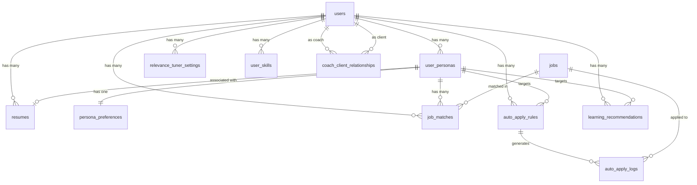

# Relevnt V2 Schema Documentation

This document describes the V2 database schema additions for Relevnt's career operating system features.

## Entity Relationships

---

## Tables

### user_personas

User job search personas with associated preferences and optional resume link.

| Column | Type | Description |
|--------|------|-------------|
| `id` | UUID | Primary key |
| `user_id` | UUID | References `auth.users` |
| `name` | VARCHAR(255) | Persona display name |
| `description` | TEXT | Optional persona description |
| `is_active` | BOOLEAN | Currently active persona flag |
| `resume_id` | UUID | References `resumes` (optional) |
| `created_at` / `updated_at` | TIMESTAMPTZ | Timestamps |

**Constraint**: `UNIQUE (user_id, name)`

**Note**: When a resume is deleted, the `resume_id` is set to NULL (ON DELETE SET NULL), preserving the persona.

---

### job_matches

Links users and their personas to jobs with match scoring and explanations.

| Column | Type | Description |
|--------|------|-------------|
| `id` | UUID | Primary key |
| `user_id` | UUID | References `auth.users` |
| `persona_id` | UUID | References `user_personas` (optional) |
| `job_id` | UUID | References `jobs` |
| `match_score` | NUMERIC(5,2) | 0-100 overall match score |
| `match_factors` | JSONB | Breakdown: `{ skill_score, salary_score, ... }` |
| `explanation` | TEXT | Human-readable match explanation |
| `is_dismissed` | BOOLEAN | User dismissed this match |
| `values_alignment` | NUMERIC | Optional values alignment score |
| `created_at` | TIMESTAMPTZ | Created timestamp |
| `expires_at` | TIMESTAMPTZ | Defaults to 7 days from creation |

---

### auto_apply_rules

Defines automation rules for job applications.

| Column | Type | Description |
|--------|------|-------------|
| `id` | UUID | Primary key |
| `user_id` | UUID | References `auth.users` |
| `persona_id` | UUID | Optional persona target |
| `name` | VARCHAR(255) | Rule display name |
| `enabled` | BOOLEAN | Active status |
| `match_score_threshold` | NUMERIC(5,2) | Minimum score to trigger |
| `max_applications_per_week` | INTEGER | Rate limit (default 5) |
| `exclude_companies` | TEXT[] | Blocklist |
| `include_only_companies` | TEXT[] | Allowlist |
| `require_all_keywords` | TEXT[] | Required keywords |
| `active_days` | TEXT[] | `['mon', 'tue', ...]` |
| `created_at` / `updated_at` | TIMESTAMPTZ | Timestamps |

---

### auto_apply_logs

Tracks auto-apply submission attempts.

| Column | Type | Description |
|--------|------|-------------|
| `id` | UUID | Primary key |
| `user_id` | UUID | References `auth.users` |
| `rule_id` | UUID | References `auto_apply_rules` |
| `job_id` | UUID | References `jobs` |
| `status` | VARCHAR(50) | `submitted`, `failed`, `withdrawn` |
| `submission_url` | VARCHAR(2000) | URL used for submission |
| `error_message` | TEXT | Error details if failed |
| `created_at` | TIMESTAMPTZ | Submission time |
| `withdrawn_at` | TIMESTAMPTZ | Withdrawal time if applicable |

---

### relevance_tuner_settings

User-defined scoring weight presets.

| Column | Type | Description |
|--------|------|-------------|
| `id` | UUID | Primary key |
| `user_id` | UUID | References `auth.users` |
| `name` | VARCHAR(255) | Preset name |
| `skill_weight` | NUMERIC(3,2) | Weight 0-1 (default 0.3) |
| `salary_weight` | NUMERIC(3,2) | Weight 0-1 (default 0.25) |
| `location_weight` | NUMERIC(3,2) | Weight 0-1 (default 0.15) |
| `remote_weight` | NUMERIC(3,2) | Weight 0-1 (default 0.2) |
| `industry_weight` | NUMERIC(3,2) | Weight 0-1 (default 0.1) |
| `is_default` | BOOLEAN | User's default preset |
| `created_at` / `updated_at` | TIMESTAMPTZ | Timestamps |

---

### user_skills

User skill inventory.

| Column | Type | Description |
|--------|------|-------------|
| `id` | UUID | Primary key |
| `user_id` | UUID | References `auth.users` |
| `skill_name` | VARCHAR(255) | Skill identifier |
| `proficiency_level` | VARCHAR(50) | `beginner`, `intermediate`, `advanced`, `expert` |
| `source` | VARCHAR(50) | `resume`, `input`, `inferred` |
| `created_at` | TIMESTAMPTZ | Created timestamp |

**Constraint**: `UNIQUE (user_id, skill_name)`

---

### learning_recommendations

AI-generated skill learning suggestions.

| Column | Type | Description |
|--------|------|-------------|
| `id` | UUID | Primary key |
| `user_id` | UUID | References `auth.users` |
| `persona_id` | UUID | Optional persona context |
| `target_skill` | VARCHAR(255) | Recommended skill to learn |
| `reason_text` | TEXT | Why this skill is recommended |
| `recommended_courses` | JSONB | `[{ name, url, provider, duration }]` |
| `estimated_duration_weeks` | INTEGER | Learning time estimate |
| `created_at` | TIMESTAMPTZ | Created timestamp |
| `expires_at` | TIMESTAMPTZ | Defaults to 30 days |

---

### coach_client_relationships

Links coaches to their clients.

| Column | Type | Description |
|--------|------|-------------|
| `id` | UUID | Primary key |
| `coach_id` | UUID | References `auth.users` (coach) |
| `client_id` | UUID | References `auth.users` (client) |
| `status` | VARCHAR(50) | `active`, `paused`, `ended` |
| `notes` | TEXT | Coach notes about client |
| `created_at` / `updated_at` | TIMESTAMPTZ | Timestamps |

**Constraint**: `UNIQUE (coach_id, client_id)`

**RLS Note**: Coaches can read/write; clients can only read their own relationships.

---

## Related Files

- Migration: [`20241211_v2_schema_expansion.sql`](file:///Users/sarahsahl/Desktop/relevnt-fresh/supabase/migrations/20241211_v2_schema_expansion.sql)
- Types: [`v2-schema.ts`](file:///Users/sarahsahl/Desktop/relevnt-fresh/src/types/v2-schema.ts)
- Personas (Phase B): [`20241210_add_personas.sql`](file:///Users/sarahsahl/Desktop/relevnt-fresh/supabase/migrations/20241210_add_personas.sql)
- Persona-Resume Association: [`20241211_add_persona_resume_association.sql`](file:///Users/sarahsahl/Desktop/relevnt-fresh/supabase/migrations/20241211_add_persona_resume_association.sql)
